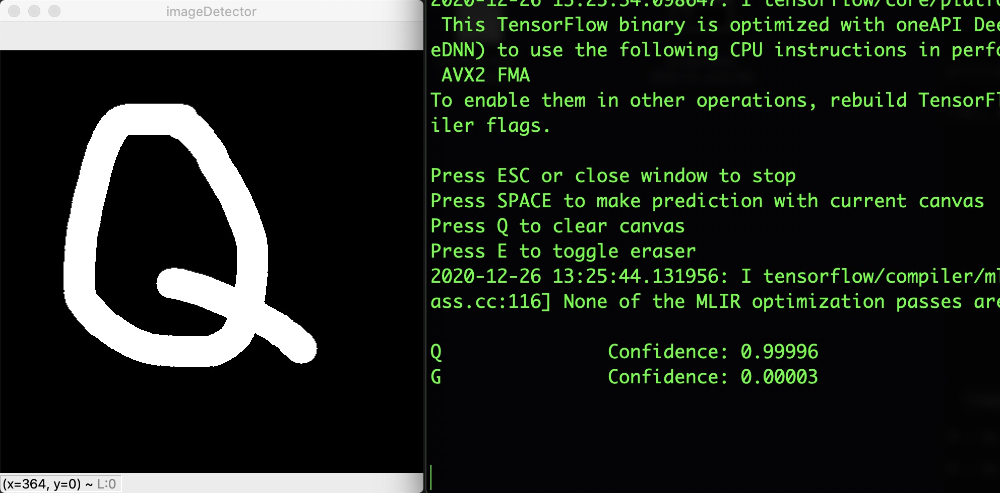
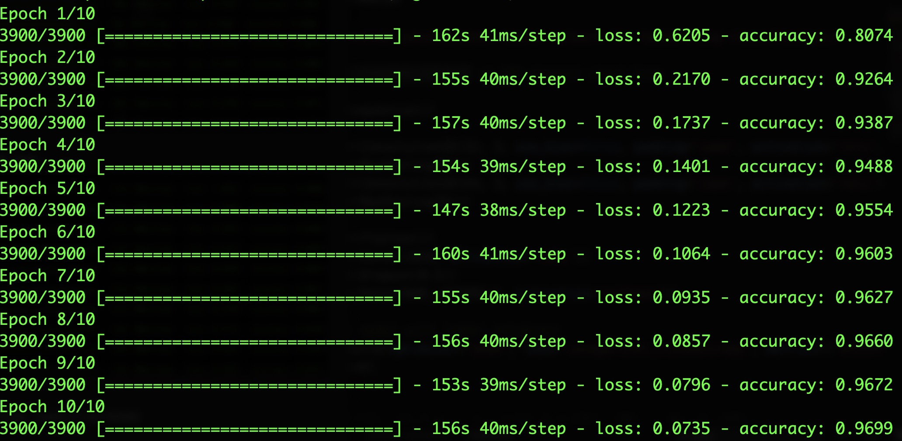

# HandwritingClassifier

This is a python application that uses convolutional neural networks (CNN) for analyzing handwriting in real time.
I have developed an 8-layered CNN architecture using Keras/Tensorflow for classifying English characters based on 28x28 hand-drawn images. I have built a real-time GUI using OpenCV/TKinter/Pillow to create a Microsoft Paint-like drawing interface based on mouse controls with a real-time neural engine for analysis. I also have a scraper for MNIST/EMINST datasets for 150k+ data points. We have trained the model on 150k characters resulting in 97% accuracy.

Framework is developed in Python. Initial steps were designing a GUI using OpenCV/Tkinter/Pillow for handing real-time drawing canvas with callbacks, mouse/keyboard controls, image processing for resizing canvas to 28x28. Next, I scraped EMNIST/MNIST datasets for labeled handwriting data. Next, I designed and built a 8-layered CNN using Keras/Tensorflow with adam optimization. Lastly, I intergrated the neural engine with the GUI for a unified app.

### Model Architecture:  
ConvNet -> Pool -> ConvNet -> Pool -> (Flatten) -> Dense -> (Dropout) -> Softmax  
28x28-[32C3-MP2-64C3-MP2]-512-27 w/ 50% dropout w/out bias

Hyperparameters Tuned:
- Convolution Subsambling Pairs: 2
- Feature Maps: 32, 64
- Dense Layer: 512
- Dropout Layer: 0.5

Training over 10 epochs
  

### Features:
- 8-layer CNN training on 150,000+ 28x28 character images
- OpenCV/Tkinter real-time GUI with mouse controls
- Interface for testing, training, modifying neural network

### Usage
    pip install -r requirements.txt
    python3 trainModel.py
    python3 draw.py
    
    Train model on first run.  
    Instructions for using GUI are displayed on launch interminal.   
    Output for neural engine appears in CLI with top 2 predicted characters and a confidence rating from 0 to 1.  
    
### Libraries Used:
- Keras/TensorFlow - Building neural network using custom engine
- OpenCV - Canvas for drawing GUI
- Tkinter/Pillow - Display 28x28 images
- Matplotlib - Displaying accuracy plots
- NumPy - Handing image objects for processing
- emnist - Accessing MNIST/EMNIST character databases
- os - Managing file system

